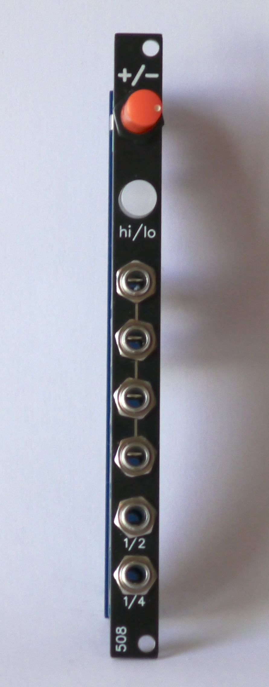
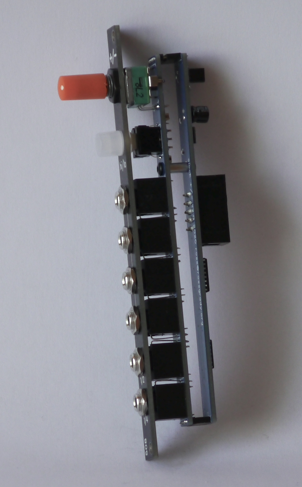

# 2hp-clock
2HP clock module w/ 1/2 and 1/4 dividers

4 outs of the main clock, plus 1 each of 1/2 and 1/4 clock division, designed to make it easy to do simple beats (or anything else requiring clock division) without needing a separate clock divider.

